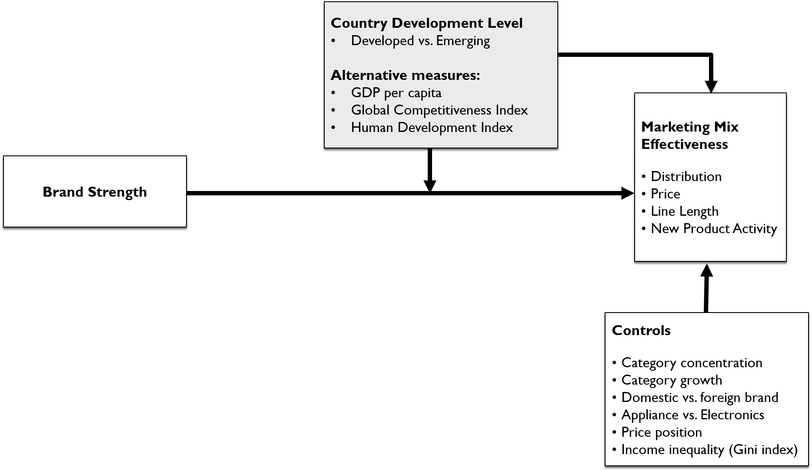

```{r setup, include=FALSE}
knitr::opts_chunk$set(echo = TRUE)

libs_to_load <- c('data.table', 'stargazer', 'knitr', 'xtable', 'car', 'kableExtra', 'stringi', 'ggplot2', 'ggpubr', 'plyr', 'gridExtra', 'grid', 'lme4', 'sjstats') #'blme' 

for (lib in libs_to_load) eval(parse(text=paste('library(', lib, ')')))

options(xtable.comment = FALSE)
options(knitr.kable.NA = '')

# Load data
  elast <- fread('../externals/elast_results_nov12sh.csv') 

  brand_panel=fread('../../analysis/temp/preclean.csv')
  brand_panel[, ':=' (date = as.Date(date))]
  
# Load auxilary functions
  source('proc_auxilary.R')
  source('proc_rename.R')

# Preclean data
  source('preclean.R')
  
# set order of variables to appear in figures and tables
ordered_vars = c('rwpspr', 'wpswdst','llen','nov12sh')
names(ordered_vars) <- paste0(unlist(sanitize_table(data.frame(ordered_vars))), ' elasticity')


  
# formulas for models
form_main_model = .~1+ (1|brand) + (1|category) + (1|country) + emerging + sbbe_std_mc + local_to_market + ln_herf_mc +ln_market_growth_mc +  ln_overall_prindexavg_mc + appliance + gini_mc

form_main_model_selected_interact = .~1+ (1|brand) + (1|category) + (1|country) + emerging + sbbe_std_mc + I(sbbe_std_mc*emerging) + local_to_market + I(local_to_market*emerging) + ln_herf_mc + I(ln_herf_mc*emerging) + ln_market_growth_mc + I(ln_market_growth_mc*emerging) + ln_overall_prindexavg_mc + appliance + gini_mc

#meanglobalx local_multip_market
#local_multip_market +

form_interact = ~1+ (1|brand) + (1|category) + (1|country) + emerging + sbbe_std_mc + I(sbbe_std_mc*emerging) + local_to_market + I(local_to_market*emerging)  +  ln_herf_mc + I(ln_herf_mc*emerging) + ln_market_growth_mc + I(ln_market_growth_mc*emerging) + appliance + I(appliance*emerging) + ln_overall_prindexavg_mc + I(ln_overall_prindexavg_mc*emerging) + gini_mc + I(gini_mc*emerging)

lmerctrl = lmerControl(optimizer ="Nelder_Mead", check.conv.singular="ignore")

#estimtype = 'winsor-onesided'
#estimtype = 'winsor-twosided'
estimtype = 'weighted'
#estimtype = 'nonweighted'

winsor_p=.01

notes_sig = 'Significance levels: \\* *p*<.1, \\*\\* *p*<.05, \\*\\*\\* *p*<.01 (two-sided).'
  
# 1-sided
if (estimtype=='winsor-onesided') {
  
  for (.var in c('elast', 'elastlt')) {
    elast[!is.na(get(.var)), (.var) := winsor_onesided(get(.var), fraction=winsor_p, ifelse(variable=='rwpspr', 'right','left')), by=c('variable')]
    elast[!is.na(get(.var)), paste0('w_', .var) := 1]
    elast[!is.na(get(.var)), paste0('z_', .var) := get(.var)/get(paste0(.var, '_se'))]
  }
   
      estimnote = paste0('Elasticities have been winsorized at ', winsor_p*100, '%, left-sided for all variables except price.')
  estimnoteshort='' 
}

# 2-sided
if (estimtype=='winsor-twosided') {
  
  for (.var in c('elast', 'elastlt')) {
    elast[!is.na(get(.var)), (.var) := winsor_onesided(get(.var), fraction=winsor_p, side='both'), by=c('variable')]
    elast[!is.na(get(.var)), paste0('w_', .var) := 1]
    elast[!is.na(get(.var)), paste0('z_', .var) := get(.var)/get(paste0(.var, '_se'))]
  }
   
      estimnote = paste0('Elasticities have been winsorized at ', winsor_p*100, '%, two-sided.')
  estimnoteshort=''
}

if (estimtype=='weighted') {
  
  for (.var in c('elast', 'elastlt')) {

    elast[!is.na(get(.var)), paste0('w_', .var) := 1/get(paste0(.var, '_se'))]
    # rescale
    elast[!is.na(get(.var)), paste0('w_', .var) := get(paste0('w_', .var))/max(get(paste0('w_', .var)))]
    elast[!is.na(get(.var)), paste0('z_', .var) := get(.var)/get(paste0(.var, '_se'))]
  }
   
      estimnote = paste0('Elasticities are weighted by inverse standard errors.')
      estimnoteshort= 'weighted by inverse standard errors'
  
}


if (estimtype=='nonweighted') {
  
  for (.var in c('elast', 'elastlt')) {

    elast[!is.na(get(.var)), paste0('w_', .var) := 1]
    elast[!is.na(get(.var)), paste0('z_', .var) := get(.var)/get(paste0(.var, '_se'))]
  }
   
      estimnote = paste0('Elasticities are unweighted.')
      estimnoteshort= 'unweighted'
  
}


notes_base = paste0("^1^ Regression of long-term elasticities on explanatory variables and three random effects, for brands, categories, and countries, respectively. Estimated using a linear mixed-effects model. ", estimnote, " Standard errors in parentheses.")

```

# Data

```{r table1_countries, echo = FALSE}
tmp=unique(elast, by='country')[, c('country','gci_00.03_gdppercap_s','gci_overall_s','hdi2010', 'developed'),with=F]
setorderv(tmp, c('developed', 'gci_00.03_gdppercap_s'), order=-1L)
first_emerging=match(0,tmp$developed)
tmp[, developed:=NULL]

tmp=sanitize_table(tmp)
colnames(tmp)[2]<-paste0(colnames(tmp)[2], '^2^')
colnames(tmp)[3]<-paste0(colnames(tmp)[3], '^2^')
colnames(tmp)[4]<-paste0(colnames(tmp)[4], '^3^')

kable(sanitize_table(tmp), format='html', initial.zero = FALSE, caption=tab('Development indicators for countries in sample^1^')) %>%
        kable_styling() %>% footnote(number=c('Countries ranked by GDP per capita.', "GDP per capita is in current USD, based on IMF World Economic Outlook Database (April 2010). Global Competitiveness Index captures microeconomic and macroeconomic foundations of national competitiveness. Both measures are extracted from the World Economic Forum's Global Competitiveness Report (2010/2011, available at https://www.weforum.org/reports/global-competitiveness-report-2010-2011).", "Human Development Index (HDI), 2010 data, obtained from UN Development Programme (http://hdr.undp.org/en/content/human-development-index-hdi). Taiwan's HDI has been imputed as the mean HDI of Thailand and China.")) %>%
  group_rows("Developed economies", 1, first_emerging-1) %>%
  group_rows("Emerging economies", first_emerging, 14)

```

```{r table2_category_overview, echo = FALSE}
tmp=data.table(elast)
tmp[, ncountries:=length(unique(country)),by=c('category')]

tmp=tmp[!grepl('allothers|unbranded', brand,ignore.case=T), list(overall_ms=mean(overall_ms), ncountries=mean(ncountries)), by = c('category', 'appliance', 'brand')]

setorderv(tmp, c('category', 'appliance', 'overall_ms'), order=-1L)
tmp[!brand%in%c('unbranded','local'), rank:=1:.N, by = c('category')]
tmp[, brand_include:= rank%in%1:5]

tmp=tmp[, list(cattype=ifelse(unique(appliance)==1, 'Appliance', 'Electronics'), ncountries=unique(ncountries), nbrands=length(unique(brand)), exemplary_brand_names=paste0((unique(brand[brand_include==T])), collapse=', ')), by='category']
tmp=sanitize_table(tmp)
setnames(tmp, 'Top 5 brands', 'Top 5 brands^2^')

try(setorder(tmp, Category),silent=T)

kable(tmp, format='html', caption=tab('Category overview^1^')) %>%
        kable_styling() %>% footnote(number=c('Categories shown in alphabetical order.', 'Top 5 brands are determined on the basis of their average volume share across countries, and are listed in decreasing order of their market shares.'))

```


`r tab('Variable operationalization for market share attraction model')`


Variable             | Operationalization
-------------------- | ------------------------------------------------------------------
Market share         | Unit sales for brand *i* in period *t*, devided by total unit sales in period *t* in a market (category/country combination).
Price                | Average price of brand *i*, computed as a sales-weighted^1^ average across its SKUs sold in period *t*, expressed in local currency and adjusted by a country's consumer price index^2^.
Distribution         | Sales-weighted^1^ distribution of each of brand *i*'s SKUs' store-weighted distribution in period *t* (0 = no market coverage, 100 = full market coverage).
Line length          | Number of unique SKUs sold by brand *i* in period *t*.
New product activity | Number of SKUs introduced by brand *i* in a rolling window of one year (*t-11*, *t-10*, *...*, *t*), expressed as a share of the total number of unique SKUs sold by brand *i* over the same period.

^1^ Weights equal to a SKU's unit sales in the most recent quarter (months *t*-2, *t*-1, *t*).

^2^ Consumer price index obtained from Thomson Reuters Datastream.

<P style='page-break-before: always'>
# Results

```{r continue_with_selection, echo=FALSE}
elast_all=data.table(elast)
elast=elast[!is.na(country_of_origin)&!tolower(brand)%in%c('unbranded')]
excluded_brands=setdiff(unique(elast_all$brand), unique(elast$brand))
excluded_brands<-unique(gsub('Allothers.*', 'Composite brands (allothers)', excluded_brands))

```

Reported for a sample of `r length(unique(elast$brand))` unique brands (excluding `r paste0(my_capitalize(excluded_brands), collapse=', ')`).


```{r elasts_full, echo=F,results='asis'}

  sigvalue = .1 # .1-level of significance
  zval = qnorm(1-sigvalue/2)

  out = lapply(list(st=c('elast', 'z_elast', 'w_elast'), lt = c('elastlt','z_elastlt','w_elastlt')), function(obj) {
               
    tmp = elast[!is.na(get(obj[1]))][, ':=' (val=get(obj[1]), val_z=get(obj[2]), val_w=get(obj[3]))]
    
    tmp=tmp[, list(Neffects=.N, median_elast = median(val), 
												  melast = sum(val*val_w)/sum(val_w),
												  perc_positive = length(which(val_z>=(zval)))/.N, 
												  perc_null = length(which(abs(val_z)<zval))/.N, 
												  perc_negative = length(which(val_z<=(-zval)))/.N), by=c('variable')]
    
  tmp=tmp[match(ordered_vars, variable)]
  setnames(tmp, 'variable', 'mmixinstr')
  return(tmp)
  })
  
iters = list(st=c('st', 'Short-term'), lt=c('lt', 'Long-term'))
for (iter in iters) {

  print(kable(sanitize_table(out[[iter[1]]]), digits=3, format='html', 
        caption=tab(paste0(iter[2], ' elasticities by marketing mix instrument^1^'),prefix='')) %>% kable_styling() %>% 
        footnote(number=paste0('Table reports ', tolower(iter[2]), ' elasticities. ', estimnote, ' Significance tested at *p*<',sigvalue, '.')))
  #cat("<P style='page-break-before: always'>")

  }

```

```{r elast_plots_countries, echo=F, fig.height=6, fig.width=10}
 
for (var in ordered_vars) {
    tmp=elast[variable==var, list(elastlt=sum(elastlt*w_elastlt)/sum(w_elastlt), N=.N), by = c('country', 'country_class')]
    setorder(tmp, elastlt)
    tmp[, cat:=rename.fkt(country, dictionary=c('renaming.txt'))]
    
    tmp[, cat:=factor(cat, levels=tmp$cat)]
 
    g<-ggplot(tmp, aes(x=cat, y=elastlt, fill = country_class)) + geom_bar(stat='identity') + ggtitle(paste0(capitalize(gsub('icity', 'icity', names(ordered_vars)[match(var, ordered_vars)])), ' by country')) + xlab('') + ylab('Long-term elasticity') + scale_fill_manual(values=c('darkblue','red'))+ theme(legend.position='none', axis.text.x=element_text(angle=45, hjust=1,size=12)) + geom_text(aes(label = formatC(elastlt,digits=2), size = 3, hjust = 0.5, vjust = 0))
    #+ labs(caption='Developed economies shown in blue; emerging economies shown in red.')
    print(g)
}

# grid.arrange(out[[1]], out[[2]], out[[3]], out[[4]], nrow=2, top = fig('Elasticities by country'), bottom = 'Developed economies shown in blue; emerging economies shown in red.')
 
```

```{r elast_by_cc, echo=F,results='asis', include=TRUE}
#sink('cc.html')
for (byvar in c('country')) {
  tmp=elast[!is.na(elastlt), list(elast = sum(elastlt*w_elastlt)/sum(w_elastlt)), by=c('variable', byvar)]
  setnames(tmp, byvar, 'byvar')
  
  tmp=dcast(tmp,byvar~variable,value.var='elast')
  setnames(tmp, 'byvar', byvar)
  setcolorder(tmp, c(byvar, ordered_vars))
  
  tmp=sanitize_table(tmp)
  setorderv(tmp, colnames(tmp)[1])
  
  cat("<P style='page-break-before: always'>")
  {print(kable(tmp, digits=3, caption = tab(paste0('Long-term elasticities (means by ', byvar, ')^1^'), prefix=''), format='html', initial.zero = FALSE) %>%
        kable_styling() %>% footnote(number=paste0(estimnote, ' Reported by ', ifelse(byvar=='country', 'countries', 'categories'), ' in alphabetical order.')))
  }
}
#sink() 

```	


```{r elasticities_overview, echo = FALSE, results='asis'}
  sigvalue = .1 # .1-level of significance
  
  zval = qnorm(1-sigvalue/2)

  out= NULL
  for (i in 1:2) {
    if (i==1) obj=c('elast', 'w_elast', 'z_elast')
    if (i==2) obj=c('elastlt','w_elastlt', 'z_elastlt')
    
    tmp = elast[!is.na(get(obj[1]))][, ':=' (val=get(obj[1]), 
                                             val_w=get(obj[2]),
                                             val_z=get(obj[3]))]
 
    # different t-tests
  
    diff_tests=lapply(c(ttest='ttest', wls='wls',re='re'), function(tvalrep) {
      
      if (tvalrep=='wls') {
      # OLS-based p values   
      diff_tests=rbindlist(lapply(unique(elast$variable), function(.var) {
        data.table(variable=.var, effect=c('constant', 'emerging'), summary(lm(val~1+emerging, weights=val_w,data=tmp[variable==.var]))$coefficients)
      }))
            taddition = paste0('Test on differences carried out by regressing elasticities (', estimnoteshort, ') on an intercept and an emerging country indicator variable. Reported t-value is obtained from the estimate of the emerging country indicator.')
  
            }
    
      if (tvalrep=='re') {
      # random effects based p values
        diff_tests=rbindlist(lapply(unique(tmp$variable), function(.var) {
        data.table(variable=.var, effect=c('constant', 'emerging'), summary(lmer(val~1+(1|category) + (1|country) + (1|brand) + emerging, weights=val_w,control = lmerctrl, data=tmp[variable==.var]))$coefficients)[, p:=2*(1-pnorm(abs(get('t value'))))]
      }))
        taddition = paste0('Test on differences carried out by regressing elasticities (', estimnoteshort, ') on an intercept, an emerging country indicator variable and three random effects, for brands, categories, and countries, respectively. Reported t-value is obtained from the estimate of the emerging country indicator.')
  
            }
    
     if (tvalrep=='ttest') {
       
    # random effects based p values
      diff_tests=rbindlist(lapply(unique(tmp$variable), function(.var) {
        xemerg=tmp[variable==.var&emerging==1]$val
        xdevel=tmp[variable==.var&emerging==0]$val
        
        tout = t.test(xemerg,xdevel)
        
      data.table(variable=.var, effect=c('emerging'), NA, NA, tout$statistic, tout$p.value)
      }))
      
      taddition = paste0('Test on differences carried out using a two-sided t-test.')
     }
  
    setnames(diff_tests, c('variable', 'effect', 'diff_est', 'diff_se', 'diff_t','diff_p'))
    diff_tests=diff_tests[effect=='emerging'][, effect:=NULL]
    diff_tests[,testtype:=tvalrep]
    return(list(diff_tests=diff_tests, notes=taddition))
    })
    
    
    ttests=melt(rbindlist(lapply(diff_tests, function(x) x$diff_tests))[, ':=' (var=variable,variable=NULL)], id.vars=c('var','testtype'))
    
    ttests=dcast(ttests, var~testtype+variable)
    setnames(ttests, 'var', 'variable')
    
    notes<-lapply(diff_tests, function(x) x$notes)
    
    
    tmp = merge(tmp, ttests, by = c('variable'))

    
    tmp=tmp[, list(Neffects= .N, 
                   all_melast = sum(val*val_w)/sum(val_w),
						 		   all_z = sum(val_z,na.rm=T)/sqrt(.N),
									 #all_sig = signstars(sum(val_z,na.rm=T)/sqrt(.N)),
												  
									 dev_Neffects= length(which(!is.na(val[developed==1]))),
				           dev_melast = sum(val[developed==1]*val_w[developed==1])/sum(val_w[developed==1]),
									 dev_z = sum(val_z[developed==1])/sqrt(length(which(!is.na(val[developed==1])))),
									 #dev_sig = signstars(sum(val_z[developed==1])/sqrt(length(which(!is.na(val[developed==1]))))),
									 
									 em_Neffects= length(which(!is.na(val[developed==0]))),
				           em_melast = sum(val[developed==0]*val_w[developed==0])/sum(val_w[developed==0]),
									 em_z = sum(val_z[developed==0])/sqrt(length(which(!is.na(val[developed==0])))),
									 #em_sig = signstars(sum(val_z[developed==0])/sqrt(length(which(!is.na(val[developed==0]))))),
									 ttest_t = unique(ttest_diff_t), ttest_sig = psignstars(unique(ttest_diff_p)),
									 wls_t = unique(wls_diff_t), wls_sig = psignstars(unique(wls_diff_p))#,
									 #re_t = unique(re_diff_t), res_sig = psignstars(unique(re_diff_p))
									                    ), by=c('variable')]

  tmp=tmp[match(ordered_vars, variable)]
  setnames(tmp, 'variable', 'mmixinstr')

  out[[i]]<-tmp
  }
  
names(out)<-c('st','lt')

#iters = list(st=c('st', 'Short-term'), lt=c('lt', 'Long-term'))
iters = list(lt=c('lt', 'Long-term'))
for (iter in iters) {
  print(kable(sanitize_table(out[[iter[1]]]), digits=3, format='html', 
        caption=tab(paste0(iter[2], ' elasticities by marketing mix instrument^1^'))) %>% kable_styling() %>% 
        footnote(number=c(paste0(notes_sig, ' ', estimnote, ' The number of observations differs slightly across marketing mix instruments because some brands in some markets (category/country combinations) do not have variation in these variables.'),notes[1],notes[2])) %>% add_header_above(c(" " = 1, "All countries" = 3, "Developed countries" = 3, "Emerging countries" = 3, 'Tests on differences' =4)))
}
  
```


<P style='page-break-before: always'>
`r fig('Conceptual framework')`




`r tab("Variable operationalization^1^")`

Construct                  | Operationalization                                     | References
------------------------- | --------------------------------------------------------|----------
Brand equity               | Sales-based brand equity, derived from the market share attraction model, standardized by category. | Datta, Ailawadi, and van Heerde (2017)
Category concentration     | Herfindahl index in a market (category/country combination).
Category growth       | Average geometric growth rate in a market (category/country combination).^2^
Appliance (vs. electronics)| Dummy, equaling 1 for appliances (washing machines, microwaves and refrigerators), 0 for all other categories.
Income inequality          | Gini index in a country.
Domestic (vs. foreign brand) | Dummy, equaling 1 if a brand's headquarter is located in the focal country, 0 if not.

^1^ All continuous variables are first logged and then mean-centered before model estimation (except brand equity, which is only mean-centered as this variable can take on negative values). 

^2^ Geometric growth rate is the n-th's square root of the ratio of the total number of unit sales in a market in the last year over total number of unit sales in the first year (both years having 12 months of data), where n is equal to the number of years in the observation window.

```{r summarystats, echo=FALSE, results='asis'}

covars <- c('sbbe_std', 'herf', 'market_growth', 'appliance', 'gini', 'local_to_market')

tmp=data.table(elast)
nbrands=length(unique(tmp$brand))
nmarkets=length(unique(tmp$market_id))
tmp = unique(tmp, by = c('market_id','brand', 'emerging'))
nobs=nrow(tmp)

# test for differences in means
diff_tests=rbindlist(lapply(covars, function(.var) {
      tmp[, val:=get(.var)]
      data.table(variable=.var, effect=c('constant', 'emerging'), summary(lm(val~1+emerging,data=tmp))$coefficients)
    }))

setnames(diff_tests, c('variable', 'effect', 'diff_est', 'diff_se', 'diff_t','diff_p'))
diff_tests=diff_tests[effect=='emerging'][, effect:=NULL]


tmp=tmp[, lapply(.SD, function(x) c(mean=mean(x,na.rm=T),sd=sd(x,na.rm=T),min=min(x,na.rm=T), max=max(x,na.rm=T))), by = c('emerging'), .SDcols=c(covars)]
tmp[, var:=rep(c('mean', 'sd','min', 'max'),2)]
tmp=melt(tmp, id.var=c('emerging', 'var'))
tmp[, emerging_label:=ifelse(emerging==1, 'emerging', 'developed')]

dtf=dcast(tmp, variable~emerging_label+var)
setcolorder(dtf, c('variable', paste0(rep(c('emerging_', 'developed_'), each=4), rep(c('mean', 'sd', 'min','max'),2))))

setnames(dtf, gsub('developed_', '', colnames(dtf)))
setnames(dtf, gsub('emerging_', '', colnames(dtf)))

setkey(diff_tests, variable)
setkey(dtf, variable)

dtf[diff_tests, ':=' (comb_t=i.diff_t, comb_sig=gsub('[*]', '\\*', psignstars(i.diff_p)))]

dtf=sanitize_table(dtf)

#sink('table.htm')
print(kable(dtf, format='html', initial.zero = FALSE, digits=3,caption = tab(paste0('Summary statistics for covariates in second-stage analysis, split by a country\'s development status^1^'))
      ) %>% kable_styling() %>% footnote(number=c(paste0('Summary statistics for variables (unlogged and not mean-centered), computed across ', nobs, ' observations in our sample.'),'Test on differences carried out by regressing variables on an intercept and an emerging country indicator variable. Reported t-value is obtained from the estimate of the emerging country indicator.')) %>% add_header_above(c(" " = 1, "Emerging countries" = 4, "Developed countries" = 4, "Test on differences^2^"=2)))
#sink()


```


```{r newanalysis, results = 'asis', include = TRUE, echo=FALSE}
# + I(sbbe_std_mc*developed))
#+ I(sbbe_std_mc*developed)

# formulas for models
upd_models = list(m1=.~1+ emerging,
                  m2 = .~1 + emerging + sbbe_std_mc)

out1=regmodel(formula=c(upd_models), dat=elast, model='lm')

upd_models2 = list(m3 = .~1 + emerging + sbbe_std_mc +(1|country) + (1|category) + (1|brand),
                   m4 = .~1 + emerging + sbbe_std_mc + (1|country) + (1|category) + (1|brand) + ln_herf_mc + ln_market_growth_mc + appliance + ln_gini_mc + local_to_market,
                   m5 = .~1 + emerging + sbbe_std_mc + I(sbbe_std_mc*emerging)+ (1|country) + (1|category) + (1|brand) + ln_herf_mc + ln_market_growth_mc + appliance + ln_gini_mc + local_to_market)
                   

#,
   #                m5 = .~1 + ln_gci_00.03_gdppercap_s_mc + sbbe_std_mc + I(sbbe_std_mc*ln_gci_00.03_gdppercap_s_mc)+ (1|brand) + (1|category) + (1|country) + ln_herf_mc + ln_market_growth_mc + appliance + ln_gini_mc + local_to_market,
#                   m6 = .~1 + ln_gci_overall_s_mc + sbbe_std_mc + I(sbbe_std_mc*ln_gci_overall_s_mc)+ (1|country) + (1|category) + (1|brand) + ln_herf_mc + ln_market_growth_mc + appliance + ln_gini_mc + local_to_market,
 #                  m7 = .~1 + ln_hdi2010_mc + sbbe_std_mc + I(sbbe_std_mc*ln_hdi2010_mc)+ (1|country) + (1|category) + (1|brand) + ln_herf_mc + ln_market_growth_mc + appliance + ln_gini_mc + local_to_market
                  
          #         )

out2=regmodel(formula=c(upd_models2), dat=elast, model='lmer')

outx = NULL

for (out in list(out1, out2)) {
  for (mod in names(out)) {
    outx[[mod]]$variable=out[[mod]]$variable
    outx[[mod]]$st=c(outx[[mod]]$st, out[[mod]]$st)
    outx[[mod]]$lt=c(outx[[mod]]$lt, out[[mod]]$lt)
  }
}
#main_interact = lapply(out2, function(x) {x$lt <- list(x$lt$main); x$st <- list(x$st$main); x})

covars = c("(Intercept)", "emerging", "ln_gci_00.03_gdppercap_s_mc","ln_gci_overall_s_mc", "ln_hdi2010_mc",
  "sbbe_std_mc", "brandz", 'brandz_global_alltime', 'brandz_financial500',
  "I(sbbe_std_mc * emerging)",
  "I(sbbe_std_mc * ln_gci_00.03_gdppercap_s_mc)",
  "I(sbbe_std_mc * ln_gci_overall_s_mc)",
  "I(sbbe_std_mc * ln_hdi2010_mc)",
  "I(brandz * emerging)",
  "I(brandz_global_alltime * emerging)",
  "I(brandz_financial500 * emerging)",
  "ln_herf_mc",
  "ln_market_growth_mc",
  "appliance",
  "ln_gini_mc",
  "local_to_market")

notes_new = paste0("^1^ ", estimnote, " Standard errors in parentheses. Continuous variables have been mean-centered.")


sink('test.htm')
for (i in 1:4) {
  cat("<P style='page-break-before: always'>")


  printout(outx, 'lt', title = tab(paste0('Regression with long-term ', gsub('ity', 'ities', names(ordered_vars[i])))), vars=ordered_vars[i],  notes=gsub('long[-]term', 'short- and long-term', notes_new), covariate_choices = covars)
}
sink()


```

```{r reset, echo=FALSE,results='asis'}
tableno<<-0
figureno<<-0
cat("<P style='page-break-before: always'>")
  
```
# Appendix

```{r sample_origin, echo=FALSE, results='asis'}

cols =  c('country_of_origin')
tmp = elast[, list(.N), by = c('brand',cols)]
tmp = tmp[, list(nbrands=length(unique(brand)), all_brands=paste(brand[order(brand)], collapse=', ')), by = cols]
tmp[country_of_origin==''|is.na(country_of_origin), country_of_origin := 'Country not available']
tmp[, country_of_origin:=my_capitalize(country_of_origin)]

setorderv(tmp, 'nbrands', order=-1L)
setcolorder(tmp, c('country_of_origin', 'nbrands', 'all_brands'))

tmp=sanitize_table(tmp)

kable(tmp, caption = tab('Country-of-origins for brands in sample, ordered by the number of brands from a given country^1^', prefix ='A'),format='html') %>%
        kable_styling() %>% footnote(number=paste0('Brand names per country listed alphabetically.'))

```

<P style='page-break-before: always'>
```{r VIFS, echo=FALSE,results='asis', include=FALSE}

m1 = ~1+ appliance + ln_market_growth_mc + ln_herf_mc + local_to_market  + ln_overall_prindexavg_mc + sbbe_std_mc

m<-lm(update(elast~., m1), data=elast[variable=='llen'])

frame1=data.frame(vif(m))
colnames(frame1) <- c('VIF')
frame1$variable=rownames(frame1)
rownames(frame1)<-NULL
frame1=frame1[, c('variable','VIF')]
frame1=sanitize_table(frame1)
cat("<P style='page-break-before: always'>")

if(0){
kable(frame1,format='html', caption = tab('Assessing multicollinearity^1^', prefix='A'))%>% kable_styling() %>% footnote(number=paste0('Table reports VIFs values calculated in regression models using main effects for all variables listed above (i.e., excluding brand, category, and country effects).'))
}
```


```{r overview2, echo=FALSE, results='asis'}
tmp = elast_all[, list(Nbrands = length(unique(brand))), by = c('market_id', 'category','country')]

tabl = dcast(tmp, category~country, value.var=c('Nbrands'))

tabl=sanitize_table(tabl)
setorder(tabl, Category)
kable(tabl, caption = tab('Overview of markets (category/country combination) in sample (with number of selected brands indicated per cell)', prefix='A'))

```

```{r correl, echo=FALSE, results = 'asis'}

tmp = dcast(elast,market_id+brand~variable, value.var=c('elast', 'elastlt'))

for (var in grep('elast', colnames(tmp),value=T)) {
  tmp[, (paste0('mc_', var)):=get(var)-mean(get(var),na.rm=T), by = c('market_id')]
  }

if(0){
  printtmp=tmp[, grep('mc[_]elast[_]', colnames(tmp),value=T) ,with=F]
  setnames(printtmp, gsub('mc[_]elast[_]','',colnames(printtmp)))
  setcolorder(printtmp, ordered_vars)
  setnames(printtmp, paste0(rename.fkt(colnames(printtmp)), ' elasticity'))
  
  
  corstars(printtmp, method=c("pearson"),result='html', caption = tab('Correlation among short-term marketing mix elasticities (mean-centered by market)'))
}

printtmp=tmp[, grep('mc[_]elastlt[_]', colnames(tmp),value=T) ,with=F]
setnames(printtmp, gsub('mc[_]elastlt[_]','',colnames(printtmp)))
setcolorder(printtmp, ordered_vars)
setnames(printtmp, paste0(rename.fkt(colnames(printtmp)), ' elasticity'))

corstars(printtmp, method=c("pearson"),result='html', caption = tab('Correlation among long-term marketing mix elasticities (mean-centered by market)', prefix='A'))

#stargazer(cor(printtmp))


```


```{r elast_by_cc2, echo=F,results='asis', include=TRUE}
#sink('cc.html')
for (byvar in c('category')) {
  tmp=elast[!is.na(elastlt), list(elast = sum(elastlt*w_elastlt)/sum(w_elastlt)), by=c('variable', byvar)]
  setnames(tmp, byvar, 'byvar')
  
  tmp=dcast(tmp,byvar~variable,value.var='elast')
  setnames(tmp, 'byvar', byvar)
  setcolorder(tmp, c(byvar, ordered_vars))
  
  tmp=sanitize_table(tmp)
  setorderv(tmp, colnames(tmp)[1])
  
  cat("<P style='page-break-before: always'>")
  {print(kable(tmp, digits=3, caption = tab(paste0('Long-term elasticities (means by ', byvar, ')^1^'), prefix='A'), format='html', initial.zero = FALSE) %>%
        kable_styling() %>% footnote(number=paste0(estimnote, ' Reported by ', ifelse(byvar=='country', 'countries', 'categories'), ' in alphabetical order.')))
  }
}
#sink() 

```	

```{r newanalysis_robust, results = 'asis', include = TRUE, echo=FALSE}
# formulas for models

upd_models2 = list(m1 = .~1 + developed + sbbe_std_mc + (1|country) + (1|category) + (1|brand) + ln_herf_mc + ln_market_growth_mc + appliance + ln_gini_mc + local_to_market,
                   m2 = .~1 + ln_gci_00.03_gdppercap_s_mc + sbbe_std_mc + (1|brand) + (1|category) + (1|country) + ln_herf_mc + ln_market_growth_mc + appliance + ln_gini_mc + local_to_market,
                   m3 = .~1 + ln_gci_overall_s_mc + sbbe_std_mc + (1|country) + (1|category) + (1|brand) + ln_herf_mc + ln_market_growth_mc + appliance + ln_gini_mc + local_to_market,
                  m4 = .~1 + ln_hdi2010_mc + sbbe_std_mc + (1|country) + (1|category) + (1|brand) + ln_herf_mc + ln_market_growth_mc + appliance + ln_gini_mc + local_to_market,
                  m5 = .~1 + developed + sbbe_std_mc + I(sbbe_std_mc*developed)+ (1|country) + (1|category) + (1|brand) + ln_herf_mc + ln_market_growth_mc + appliance + ln_gini_mc + local_to_market,
                   m6 = .~1 + ln_gci_00.03_gdppercap_s_mc + sbbe_std_mc + I(sbbe_std_mc*ln_gci_00.03_gdppercap_s_mc)+ (1|brand) + (1|category) + (1|country) + ln_herf_mc + ln_market_growth_mc + appliance + ln_gini_mc + local_to_market,
                   m7 = .~1 + ln_gci_overall_s_mc + sbbe_std_mc + I(sbbe_std_mc*ln_gci_overall_s_mc)+ (1|country) + (1|category) + (1|brand) + ln_herf_mc + ln_market_growth_mc + appliance + ln_gini_mc + local_to_market,
                  m8 = .~1 + ln_hdi2010_mc + sbbe_std_mc + I(sbbe_std_mc*ln_hdi2010_mc)+ (1|country) + (1|category) + (1|brand) + ln_herf_mc + ln_market_growth_mc + appliance + ln_gini_mc + local_to_market)
       

out2=regmodel(formula=c(upd_models2), dat=elast, model='lmer')

outx = NULL

for (out in list(out2)) {
  for (mod in names(out)) {
    outx[[mod]]$variable=out[[mod]]$variable
    outx[[mod]]$st=c(outx[[mod]]$st, out[[mod]]$st)
    outx[[mod]]$lt=c(outx[[mod]]$lt, out[[mod]]$lt)
  }
}
#main_interact = lapply(out2, function(x) {x$lt <- list(x$lt$main); x$st <- list(x$st$main); x})

covars = c("(Intercept)", "developed", "ln_gci_00.03_gdppercap_s_mc","ln_gci_overall_s_mc", "ln_hdi2010_mc",
  "sbbe_std_mc", "brandz", 'brandz_global_alltime', 'brandz_financial500',
  "I(sbbe_std_mc * developed)",
  "I(sbbe_std_mc * ln_gci_00.03_gdppercap_s_mc)",
  "I(sbbe_std_mc * ln_gci_overall_s_mc)",
  "I(sbbe_std_mc * ln_hdi2010_mc)",
  "I(brandz * developed)",
  "I(brandz_global_alltime * developed)",
  "I(brandz_financial500 * developed)",
  "ln_herf_mc",
  "ln_market_growth_mc",
  "appliance",
  "ln_gini_mc",
  "local_to_market")

notes_new = paste0("^1^ ", estimnote, " Standard errors in parentheses. Continuous variables have been mean-centered.")


sink('test.htm')
for (i in 1:4) {
  cat("<P style='page-break-before: always'>")


  printout(outx, 'lt', title = tab(paste0('Robustness check with long-term ', gsub('ity', 'ities', names(ordered_vars[i])), ' and alternative metrics for a country\'s development degree'), prefix='A'), vars=ordered_vars[i],  notes=gsub('long[-]term', 'short- and long-term', notes_new), covariate_choices = covars)
}
sink()


```

```{r newanalysis_beta, results = 'asis', include = TRUE, echo=FALSE}

# formulas for models
upd_models = list(m1=.~1+ developed,
                  m2 = .~1 + developed + sbbe_std_mc + I(sbbe_std_mc*developed))

elast_backup = data.table(elast)
elast[is.na(gamma_lagms), gamma_lagms:=0]

elast[, elastlt := beta/(1-gamma_lagms)]

out1=regmodel(formula=c(upd_models), dat=elast, model='lm')

upd_models2 = list(m3 = .~1 + developed + sbbe_std_mc + I(sbbe_std_mc*developed)+(1|country) + (1|category) + (1|brand),
                   m4 = .~1 + developed + sbbe_std_mc + I(sbbe_std_mc*developed)+ (1|country) + (1|category) + (1|brand) + ln_herf_mc + ln_market_growth_mc + appliance + ln_gini_mc + local_to_market,
                   m5 = .~1 + ln_gci_00.03_gdppercap_s_mc + sbbe_std_mc + I(sbbe_std_mc*ln_gci_00.03_gdppercap_s_mc)+ (1|brand) + (1|category) + (1|country) + ln_herf_mc + ln_market_growth_mc + appliance + ln_gini_mc + local_to_market,
                   m6 = .~1 + ln_gci_overall_s_mc + sbbe_std_mc + I(sbbe_std_mc*ln_gci_overall_s_mc)+ (1|country) + (1|category) + (1|brand) + ln_herf_mc + ln_market_growth_mc + appliance + ln_gini_mc + local_to_market,
                   m7 = .~1 + ln_hdi2010_mc + sbbe_std_mc + I(sbbe_std_mc*ln_hdi2010_mc)+ (1|country) + (1|category) + (1|brand) + ln_herf_mc + ln_market_growth_mc + appliance + ln_gini_mc + local_to_market
                  
                   )

out2=regmodel(formula=c(upd_models2), dat=elast, model='lmer')

outx = NULL

for (out in list(out1, out2)) {
  for (mod in names(out)) {
    outx[[mod]]$variable=out[[mod]]$variable
    outx[[mod]]$st=c(outx[[mod]]$st, out[[mod]]$st)
    outx[[mod]]$lt=c(outx[[mod]]$lt, out[[mod]]$lt)
  }
}
#main_interact = lapply(out2, function(x) {x$lt <- list(x$lt$main); x$st <- list(x$st$main); x})

covars = c("(Intercept)", "developed", "ln_gci_00.03_gdppercap_s_mc","ln_gci_overall_s_mc", "ln_hdi2010_mc",
  "sbbe_std_mc", "brandz", 'brandz_global_alltime', 'brandz_financial500',
  "I(sbbe_std_mc * developed)",
  "I(sbbe_std_mc * ln_gci_00.03_gdppercap_s_mc)",
  "I(sbbe_std_mc * ln_gci_overall_s_mc)",
  "I(sbbe_std_mc * ln_hdi2010_mc)",
  "I(brandz * developed)",
  "I(brandz_global_alltime * developed)",
  "I(brandz_financial500 * developed)",
  "ln_herf_mc",
  "ln_market_growth_mc",
  "appliance",
  "ln_gini_mc",
  "local_to_market")

notes_new = paste0("^1^ ", estimnote, " Standard errors in parentheses. Continuous variables have been mean-centered.")


#sink('test.htm')
for (i in 1:4) {
  cat("<P style='page-break-before: always'>")


  printout(outx, 'lt', title = tab(paste0('Regression with beta/(1-lambda) for ', gsub('ity', 'ities', names(ordered_vars[i]))), prefix='A'), vars=ordered_vars[i],  notes=gsub('long[-]term', 'short- and long-term', notes_new), covariate_choices = covars)
}
#sink()


```


```{r newanalysis_control, results = 'asis', include = TRUE, echo=FALSE}
elast = data.table(elast_backup)

elast[!is.na(elastlt), mean_ms_mc := mean_ms-mean(mean_ms,na.rm=T), by = c('variable')]

# formulas for models
upd_models = list(m1=.~1+ developed + mean_ms_mc,
                  m2 = .~1 + developed + sbbe_std_mc + I(sbbe_std_mc*developed) + mean_ms_mc)


out1=regmodel(formula=c(upd_models), dat=elast, model='lm')

upd_models2 = list(m3 = .~1 + developed + sbbe_std_mc + I(sbbe_std_mc*developed) + mean_ms_mc+(1|country) + (1|category) + (1|brand),
                   m4 = .~1 + developed + sbbe_std_mc + I(sbbe_std_mc*developed) + mean_ms_mc+ (1|country) + (1|category) + (1|brand) + ln_herf_mc + ln_market_growth_mc + appliance + ln_gini_mc + local_to_market + mean_ms_mc,
                   m5 = .~1 + ln_gci_00.03_gdppercap_s_mc + sbbe_std_mc + I(sbbe_std_mc*ln_gci_00.03_gdppercap_s_mc)+ (1|brand) + (1|category) + (1|country) + ln_herf_mc + ln_market_growth_mc + appliance + ln_gini_mc + local_to_market + mean_ms_mc,
                   m6 = .~1 + ln_gci_overall_s_mc + sbbe_std_mc + I(sbbe_std_mc*ln_gci_overall_s_mc)+ (1|country) + (1|category) + (1|brand) + ln_herf_mc + ln_market_growth_mc + appliance + ln_gini_mc + local_to_market + mean_ms_mc,
                   m7 = .~1 + ln_hdi2010_mc + sbbe_std_mc + I(sbbe_std_mc*ln_hdi2010_mc)+ (1|country) + (1|category) + (1|brand) + ln_herf_mc + ln_market_growth_mc + appliance + ln_gini_mc + local_to_market + mean_ms_mc
                  
                   )

out2=regmodel(formula=c(upd_models2), dat=elast, model='lmer')

outx = NULL

for (out in list(out1, out2)) {
  for (mod in names(out)) {
    outx[[mod]]$variable=out[[mod]]$variable
    outx[[mod]]$st=c(outx[[mod]]$st, out[[mod]]$st)
    outx[[mod]]$lt=c(outx[[mod]]$lt, out[[mod]]$lt)
  }
}
#main_interact = lapply(out2, function(x) {x$lt <- list(x$lt$main); x$st <- list(x$st$main); x})

covars = c("(Intercept)", "developed", "ln_gci_00.03_gdppercap_s_mc","ln_gci_overall_s_mc", "ln_hdi2010_mc",
  "sbbe_std_mc", "brandz", 'brandz_global_alltime', 'brandz_financial500',
  "I(sbbe_std_mc * developed)",
  "I(sbbe_std_mc * ln_gci_00.03_gdppercap_s_mc)",
  "I(sbbe_std_mc * ln_gci_overall_s_mc)",
  "I(sbbe_std_mc * ln_hdi2010_mc)",
  "I(brandz * developed)",
  "I(brandz_global_alltime * developed)",
  "I(brandz_financial500 * developed)",
  "ln_herf_mc",
  "ln_market_growth_mc",
  "appliance",
  "ln_gini_mc",
  "local_to_market",
  "mean_ms_mc")

notes_new = paste0("^1^ ", estimnote, " Standard errors in parentheses. Continuous variables have been mean-centered, except a brand's mean market share.")


for (i in 1:4) {
  cat("<P style='page-break-before: always'>")

  printout(outx, 'lt', title = tab(paste0('Regression with long-term elasticities for ', gsub('ity', 'ities', names(ordered_vars[i])), ', controlling for market shares'), prefix='A'), vars=ordered_vars[i],  notes=gsub('long[-]term', 'short- and long-term', notes_new), covariate_choices = covars)
}


```